### Project training (mobile internet)

#### Introduction

Our organization is composed of four students who participating in the project training course together in the summer of 2019. The name of our group is "singing dancing bug basketball" (lawyer letter warning!)

The specific requirements of this project are detailed in [Requirements](./哈尔滨工业大学软件开发项目训练.pdf)
The project consists of three applications:
+ [Android Client](https://github.com/singing-dancing-bug-basketball/Android)
+ [Web front end](https://github.com/singing-dancing-bug-basketball/Server)
+ [Web back end](https://github.com/singing-dancing-bug-basketball/Server)

#### Document

+ [E-R diagram](#er_diagram)
+ [DataBase](./DataBase.md)
+ [Definition of server's restful API](./interface.md)

### 项目实训(移动互联)

#### 介绍

本组织是由2019年暑期一起参与项目实训课程的小组四人组成,小组名称:唱跳bug篮球(律师函警告!)

本项目的具体要求详见[要求](./哈尔滨工业大学软件开发项目训练.pdf)
项目由三个部分组成:
+ [安卓客户端](https://github.com/singing-dancing-bug-basketball/Android)
+ [Web前端](https://github.com/singing-dancing-bug-basketball/Server)
+ [Web后端](https://github.com/singing-dancing-bug-basketball/Server)

#### 文档

+ [E-R图](#er_diagram)
+ [DataBase](./DataBase.md)
+ [服务器的restful API规约](./interface.md)

#### ER_diagram
